# 互联网商业模式全景图：12 种主流盈利模式深度解析

> 在这个数字化时代，商业模式决定了一家企业的生死存亡。本文将带你系统梳理互联网行业最主流的 12 种商业模式，从广告到共享经济，从订阅到生态闭环，每一款都是真金白银的赚钱秘籍。

---

## 引言：为什么商业模式如此重要？

在开始之前，让我们先看一个简单的事实：**单一模式的公司越来越少，多元化收入结构成为主流**。无论是 Google、腾讯还是阿里，这些巨头都在不断拓展自己的商业边界。

理解商业模式，就是理解一家公司如何赚钱、如何持续赚钱、如何在竞争中保持优势。本文将带你深入剖析每一种模式的核心原理、运作流程、优势与挑战。

---

## 一、广告模式：注意力的生意

### 核心原理

平台提供免费服务吸引海量用户，积累用户注意力和行为数据，然后将用户的注意力作为商品出售给广告主。广告主为了触达目标受众，向平台支付广告费用。

这种模式的核心在于**用户注意力的买卖**。平台充当中介，连接愿意付费的广告主和提供注意力的用户。

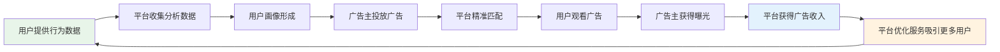

### 典型案例

- **Google**：搜索广告 + 展示广告
- **Facebook/Meta**：社交广告
- **字节跳动**：信息流广告
- **微博**：社交媒体广告

### 广告计费模式

| 模式 | 定义 | 适用场景 |
|------|------|----------|
| **CPC** (Cost Per Click) | 按点击付费 | 追求流量和转化的品牌 |
| **CPM** (Cost Per Mille) | 按千次展示付费 | 品牌曝光为主的活动 |
| **CPS** (Cost Per Sale) | 按销售付费 | 电商、直接销售类广告 |

### 优势与缺点

**优势：**
- ✓ 用户免费使用，获客成本低，快速积累用户规模
- ✓ 规模化能力强，用户越多广告展示机会越多
- ✓ 可结合大数据和 AI 实现精准广告投放
- ✓ 边际成本几乎为零

**缺点：**
- ✗ 过度依赖广告收入，经济周期波动影响大
- ✗ 用户体验与广告存在天然矛盾
- ✗ 需要庞大的用户基数才能实现盈利
- ✗ 隐私保护要求越来越高，监管风险增加

---

## 二、平台佣金模式：撮合交易的中介

### 核心原理

平台构建连接供需双方的市场，通过降低交易成本、提高匹配效率来吸引双方入驻。当交易发生时，平台按交易额的一定比例收取佣金或服务费。

这种模式依靠**双边网络效应**运作：一边用户越多，对另一边的价值越大。

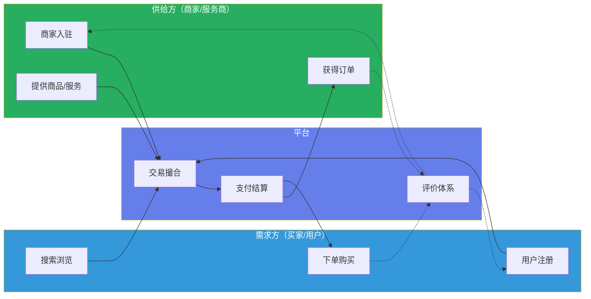

### 典型案例

- **淘宝/天猫**：电商交易平台
- **美团**：本地生活服务平台
- **滴滴**：出行服务平台
- **Airbnb**：短租住宿平台

### 佣金结构类型

| 类型 | 说明 |
|------|------|
| **固定比例佣金** | 按交易金额的固定比例收取（如 5%、10%） |
| **阶梯佣金** | 交易量越大，佣金比例越低 |
| **固定金额** | 每笔交易收取固定费用 |
| **会员费 + 佣金** | 收取会员费降低单笔佣金 |

### 优势与缺点

**优势：**
- ✓ 网络效应强，规模越大平台价值越高
- ✓ 收入与交易规模直接相关，随着平台发展自然增长
- ✓ 不需要拥有库存或资产，资产轻，风险低
- ✓ 平台掌握定价权和规则制定权

**缺点：**
- ✗ 双边市场的冷启动难题
- ✗ 容易受监管和反垄断调查
- ✗ 商家和用户可能绕过平台直接交易
- ✗ 竞争激烈，护城河难建立

---

## 三、订阅模式：持续的收入流

### 核心原理

用户支付固定费用获得一段时间内的服务使用权。平台通过持续提供价值来留住用户，依靠长期订阅获得稳定的现金流。

订阅模式将**一次性交易转化为长期关系**，关键在于保持用户满意度，持续交付价值。

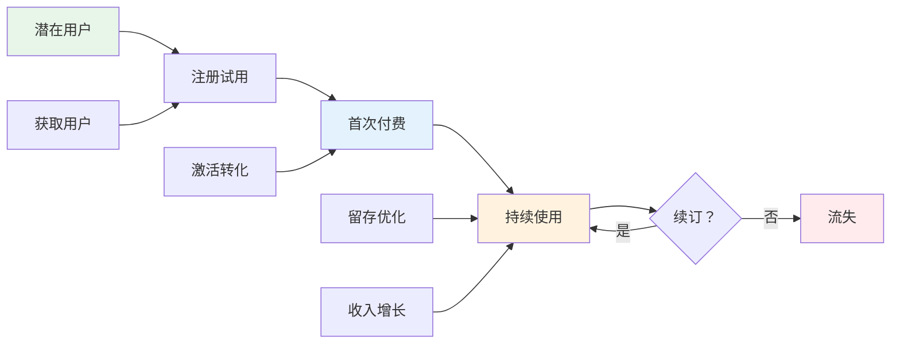

### 典型案例

- **Netflix**：视频流媒体订阅
- **Spotify**：音乐流媒体订阅
- **Office 365**：办公软件订阅
- **各种 SaaS**：企业软件服务

### 关键指标

| 指标 | 含义 |
|------|------|
| **MRR** | 月度经常性收入 (Monthly Recurring Revenue) |
| **ARR** | 年度经常性收入 (Annual Recurring Revenue) |
| **Churn** | 流失率 |
| **LTV** | 用户生命周期价值 (Lifetime Value) |

### 优势与缺点

**优势：**
- ✓ 收入可预测，便于财务规划和预算分配
- ✓ 长期用户生命周期价值高，可持续盈利
- ✓ 与客户建立持续关系，便于交叉销售和增购
- ✓ 流失率指标便于监控和优化

**缺点：**
- ✗ 获客成本高，需要长期才能回本
- ✗ 用户取消订阅容易，留存压力大
- ✗ 需要持续创新以保持价值感知
- ✗ 初期可能亏损，需要大量资金投入

---

## 四、免费增值模式：从免费到付费的转化

### 核心原理

提供有限但足够使用的基础功能免费吸引用户，同时提供高级功能或更多资源限制解除的付费版本。**免费用户作为营销渠道和产品测试对象**，部分用户转化为付费用户。

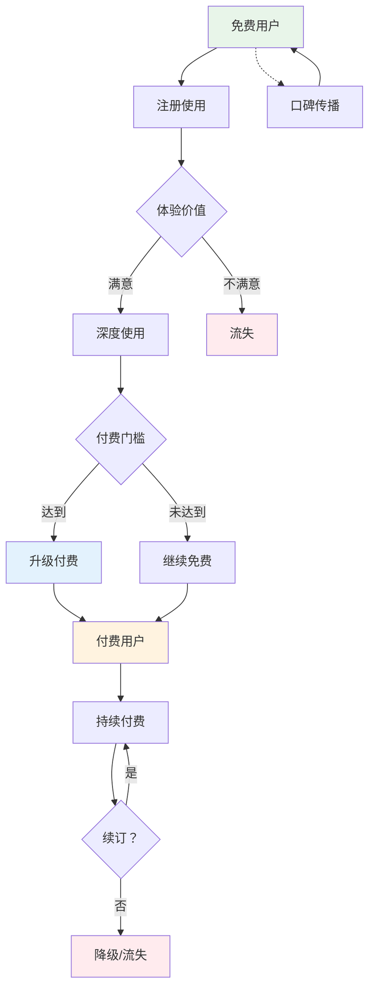

### 典型案例

- **Dropbox**：云存储服务
- **Slack**：企业协作工具
- **Canva**：在线设计工具
- **Notion**：知识管理工具

### 常见限制类型

| 限制类型 | 说明 |
|----------|------|
| **功能限制** | 高级功能仅付费用户可用 |
| **容量限制** | 限制存储空间、上传文件大小 |
| **次数限制** | 限制每日/每周使用次数 |
| **时间限制** | 免费试用期后功能受限 |

### 转化漏斗数据

典型的 Freemium 模式转化率：

```
注册用户 → 100% (10,000)
活跃用户 → 60% (6,000)
深度用户 → 25% (2,500)
付费用户 → 5% (500)
```

**典型转化率通常在 2%-5% 之间**

### 优势与缺点

**优势：**
- ✓ 免费获客，降低营销成本
- ✓ 用户可以先体验再决定付费，降低决策门槛
- ✓ 免费用户形成网络效应和口碑传播
- ✓ 可以大规模测试产品功能，快速迭代优化

**缺点：**
- ✗ 转化率通常较低（2%-5%）
- ✗ 免费用户产生成本但无收入
- ✗ 免费与付费的边界难以平衡
- ✗ 过度免费可能降低付费意愿

---

## 五、交易手续费模式：金融服务的盈利

### 核心原理

为交易双方提供支付清算、资金托管、信用担保等金融服务，按每笔交易金额收取固定比例或固定金额的手续费。**交易量越大，收入越高**。

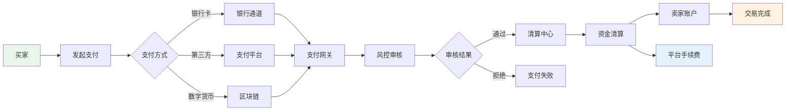

### 典型案例

- **PayPal**：国际支付平台
- **Stripe**：在线支付处理
- **支付宝**：中国领先的支付平台
- **微信支付**：社交支付巨头

### 手续费类型

| 类型 | 说明 |
|------|------|
| **按比例收费** | 按交易金额的固定比例收取（如 1%-3%） |
| **固定金额** | 每笔交易收取固定费用（如每笔 0.5 元） |
| **混合模式** | 固定金额 + 按比例（如 0.1 元 +0.5%） |
| **阶梯费率** | 交易量越大，费率越低 |

### 收入来源

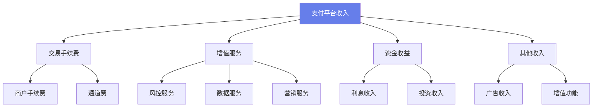

### 优势与缺点

**优势：**
- ✓ 收入随经济发展自然增长
- ✓ 现金流充裕，资金沉淀可产生收益
- ✓ 进入壁垒高，需要牌照和资质
- ✓ 网络效应和转换成本强

**缺点：**
- ✗ 高度依赖监管政策，合规成本高
- ✗ 费率受到行业竞争压力
- ✗ 欺诈风险和资金安全问题
- ✗ 需要大量技术和安全投入

---

## 六、云服务模式：计算资源的商品化

### 核心原理

按使用量计费提供 IT 基础设施服务，企业无需自建机房和购买硬件。云服务商通过规模效应降低成本，并提供丰富的附加服务。

**云服务将计算资源像水电一样商品化**，用户用多少付多少。

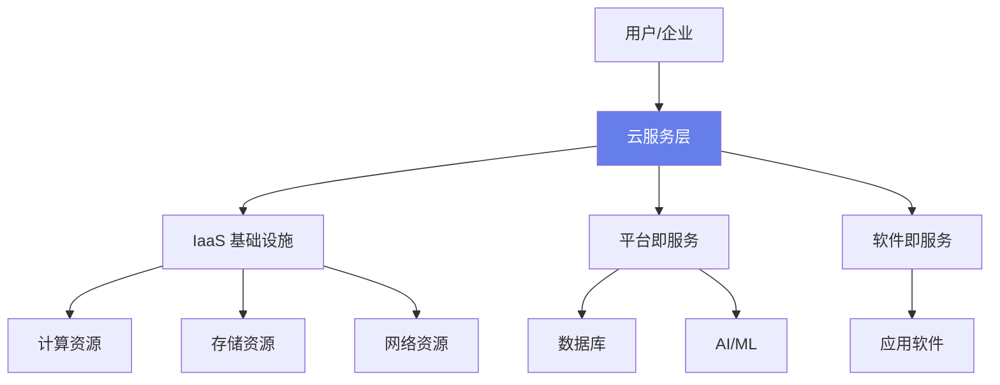

### 服务类型

| 类型 | 全称 | 服务内容 |
|------|------|----------|
| **IaaS** | Infrastructure as a Service | 虚拟机、存储、网络 |
| **PaaS** | Platform as a Service | 开发环境、数据库 |
| **SaaS** | Software as a Service | 在线应用、协作工具 |
| **FaaS** | Function as a Service | 无服务器计算 |

### 典型案例

- **AWS**：亚马逊云服务，全球最大
- **Azure**：微软云服务
- **阿里云**：中国最大云服务提供商
- **腾讯云**：社交游戏云领先者

### 优势与缺点

**优势：**
- ✓ 持续稳定的收入流
- ✓ 客户粘性极高，迁移成本大
- ✓ 可扩展性强，边际成本低
- ✓ 可提供多种增值服务提升 ARPU 值

**缺点：**
- ✗ 前期投入巨大，重资产运营
- ✗ 技术门槛高，需要顶尖人才
- ✗ 竞争激烈，价格战频繁
- ✗ 数据安全和隐私合规挑战大

---

## 七、内容付费/知识付费：信息的价值变现

### 核心原理

平台或创作者生产优质内容，用户为获取高质量信息或娱乐体验付费。内容形式包括在线课程、电子书、音频、专栏会员等。

**核心在于内容质量和用户价值感知**。

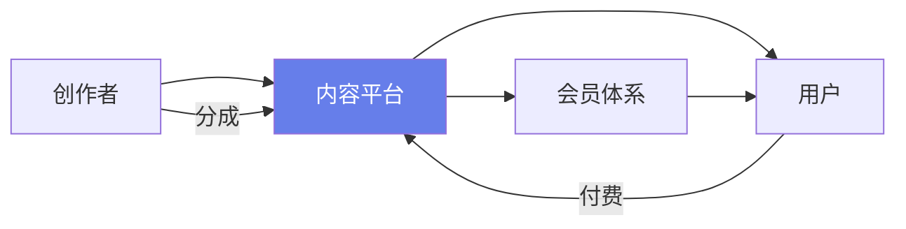

### 典型案例

- **得到**：知识服务平台
- **喜马拉雅 VIP**：音频内容订阅
- **知识星球**：社群知识付费
- **付费课程**：各类在线教育平台

### 内容类型

| 类型 | 形式 |
|------|------|
| **在线课程** | 系统化教学视频、实战训练营 |
| **音频内容** | 知识专栏、播客、有声书 |
| **图文专栏** | 深度文章、行业报告 |
| **会员订阅** | 包月/包年会员专属内容 |

### 优势与缺点

**优势：**
- ✓ 内容可复用，边际成本低
- ✓ 创作者可直接变现
- ✓ 品类可规模化
- ✓ 建立个人品牌

**缺点：**
- ✗ 内容同质化严重
- ✗ 用户付费意愿培养难
- ✗ 盗版问题难以杜绝
- ✗ 需要持续产出高质量内容

---

## 八、生态闭环模式：硬件 + 软件 + 服务的深度绑定

### 核心原理

通过硬件设备、操作系统、应用商店、服务体系形成完整闭环，用户被锁定在生态系统内难以脱离。**多种产品和服务相互促进，形成强大的网络效应和用户粘性**。

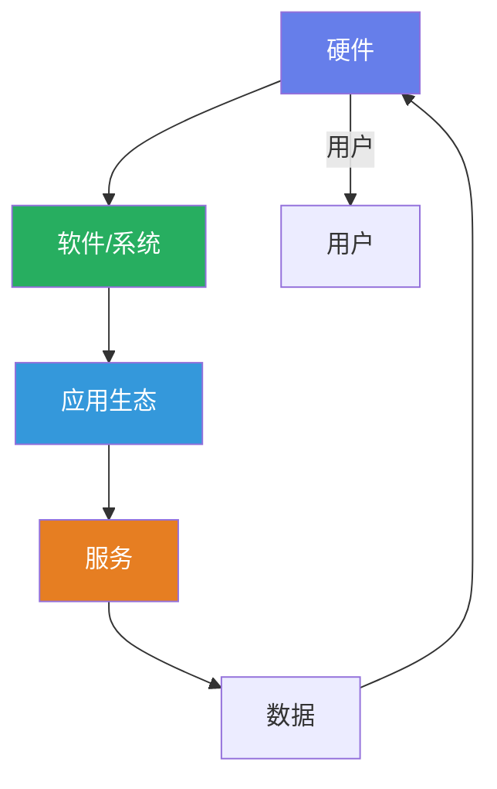

### 典型案例

- **Apple**：iPhone + iOS + App Store + iCloud
- **小米**：手机 + MIUI + 米家生态链
- **华为**：手机 + HarmonyOS + 华为服务

### 用户旅程

```mermaid
sequenceDiagram
    participant 用户
    participant 硬件
    participant 软件
    participant 服务
    用户->>硬件：购买设备
    硬件->>软件：激活系统
    软件->>服务：登录账号
    服务->>软件：同步数据
    软件->>硬件：体验增值
    服务->>用户：推荐更多产品
    用户->>硬件：复购/推荐
```

### 优势与缺点

**优势：**
- ✓ 用户粘性极强，迁移成本高
- ✓ 多产品协同效应
- ✓ 数据互通提升体验
- ✓ 品牌溢价能力强

**缺点：**
- ✗ 投入巨大，周期长
- ✗ 单一产品失败可能影响整体
- ✗ 创新受限，生态可能固化
- ✗ 供应链管理复杂

---

## 九、数据变现模式：数据的商业价值

### 核心原理

通过收集、整合、分析用户数据，形成有价值的洞察和画像，出售给需要精准营销或决策支持的企业。

**数据来源包括用户行为、交易记录、社交网络等**。

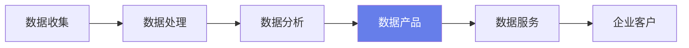

### 典型案例

- **各类大数据公司**：提供数据分析服务
- **DMP 平台**：数据管理平台
- **精准营销公司**：基于数据的广告投放

### 数据服务类型

```mermaid
sequenceDiagram
    participant 企业
    participant 数据平台
    participant 用户
    企业->>数据平台：购买数据服务
    数据平台->>企业：提供用户画像/洞察
    企业->>数据平台：查询实时数据
    数据平台->>企业：返回分析结果
    企业->>用户：精准营销
```

### 优势与缺点

**优势：**
- ✓ 边际成本低，可复用性强
- ✓ 市场需求大
- ✓ 可规模化复制
- ✓ 技术门槛高

**缺点：**
- ✗ 隐私合规风险高
- ✗ 数据质量要求高
- ✗ 竞争激烈
- ✗ 用户信任敏感

---

## 十、游戏模式：娱乐的盈利艺术

### 核心原理

通过游戏内购买、订阅、广告等多种方式盈利。**免费游戏 (F2P) 通过内购创收，买断制则通过一次性付费获得完整游戏体验**。

游戏吸金能力极强，用户付费意愿高。

### 盈利模式类型

| 模式 | 说明 |
|------|------|
| **F2P+ 内购** | 免费游玩，道具/皮肤付费 |
| **买断制** | 一次性付费，完整游戏 |
| **订阅制** | 月卡/年卡，会员特权 |
| **Battle Pass** | 赛季通行证，里程碑奖励 |

### 典型案例

- **腾讯游戏**：王者荣耀、和平精英
- **Steam**：游戏平台
- **网易游戏**：梦幻西游、阴阳师

### 用户付费流程

```mermaid
sequenceDiagram
    participant 玩家
    participant 游戏
    participant 支付
    玩家->>游戏：游玩免费内容
    游戏->>玩家：展示付费道具/皮肤
    玩家->>游戏：选择购买
    游戏->>支付：发起支付
    支付->>游戏：支付成功
    游戏->>玩家：发放道具/皮肤
```

### 优势与缺点

**优势：**
- ✓ 用户基数大，付费率高
- ✓ ARPPU 值极高
- ✓ 社交属性强，传播快
- ✓ 可持续运营更新

**缺点：**
- ✗ 开发成本高
- ✗ 生命周期有限
- ✗ 监管趋严
- ✗ 竞争激烈

---

## 十一、直播/打赏模式：实时互动的变现

### 核心原理

主播通过直播内容吸引粉丝，粉丝通过购买虚拟货币打赏主播，平台从中抽取分成。**形成了主播 - 平台 - 用户三方共赢的生态**。

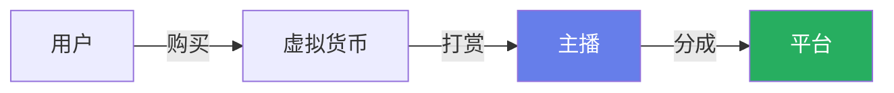

### 典型案例

- **抖音直播**：短视频 + 直播
- **虎牙**：游戏直播平台
- **斗鱼**：游戏直播平台

### 收入来源

```mermaid
sequenceDiagram
    participant 用户
    participant 平台
    participant 主播
    用户->>平台：购买虚拟货币
    用户->>平台：打赏主播
    平台->>主播：计算分成
    平台->>平台：收取平台费
    主播->>主播：获得收入
```

### 优势与缺点

**优势：**
- ✓ 实时互动性强
- ✓ 变现效率高
- ✓ 用户粘性大
- ✓ 社交属性强

**缺点：**
- ✗ 监管风险高
- ✗ 头部主播依赖
- ✗ 内容质量难保证
- ✗ 成本高，带宽费用大

---

## 十二、共享经济模式：闲置资源的价值释放

### 核心原理

通过平台将个人或企业的闲置资源（如车辆、房屋、充电宝等）与需求方匹配，提高资源利用率。**本质是资产所有权与使用权的分离**。

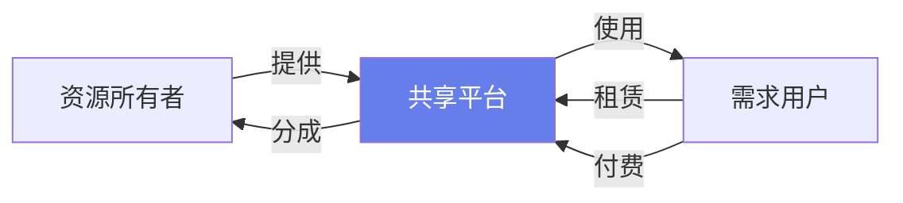

### 典型案例

- **共享单车**：美团单车、哈啰出行
- **共享充电宝**：街电、怪兽充电
- **共享办公**：WeWork、优客工场

### 运营模式

```mermaid
sequenceDiagram
    participant 用户
    participant 平台
    participant 资源方
    用户->>平台：查找资源
    平台->>用户：匹配资源
    用户->>平台：预约/支付
    平台->>资源方：通知提供
    资源方->>用户：交付资源
    用户->>平台：使用完成
    平台->>资源方：结算收益
```

### 优势与缺点

**优势：**
- ✓ 提高资源利用率
- ✓ 满足即时需求
- ✓ 降低用户成本
- ✓ 环保可持续

**缺点：**
- ✗ 重资产运营
- ✗ 维护成本高
- ✗ 损耗风险大
- ✗ 盈利困难

---

## 趋势观察：商业模式的未来

### 新消费趋势

| 趋势 | 说明 |
|------|------|
| **AI 驱动的个性化服务** | AI 技术正在重塑各行业，从智能客服到个性化推荐 |
| **理性消费回归** | 消费者更注重性价比，储蓄意愿增强 |
| **Z 世代消费特征** | 追求个性化、社交化、体验式消费 |
| **银发经济崛起** | 老年人消费能力提升，适老化产品需求增长 |

### 新兴商业模式分布

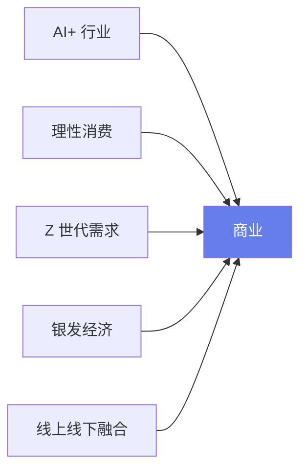

### 消费习惯变化

| 维度 | 传统模式 | 新趋势 |
|------|----------|--------|
| **购物决策** | 品牌导向 | 口碑 + 性价比 |
| **信息获取** | 搜索为主 | 算法推荐 |
| **支付意愿** | 储蓄优先 | 即时满足 |
| **社交属性** | 弱 | 强 |

---

## 国内公司商业模式分析

### 行业分布

| 行业 | 代表公司 |
|------|----------|
| **社交** | 微信、微博、抖音 |
| **电商** | 淘宝、京东、拼多多 |
| **O2O** | 美团、饿了么 |
| **新能源** | 比亚迪、宁德时代 |
| **硬科技** | 芯片、AI、大模型 |

### 商业模式组合

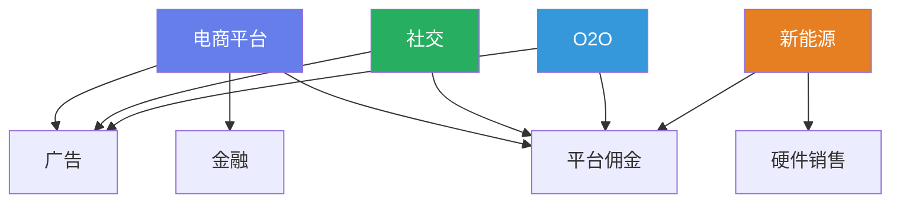

### 典型模式对比

| 公司类型 | 核心模式 | 收入来源 |
|----------|----------|----------|
| **电商平台** | 平台佣金 + 广告 | 交易抽成、营销服务 |
| **社交平台** | 广告 + 增值 | 广告、游戏、会员 |
| **O2O** | 佣金 + 配送 | 交易抽成、物流服务 |
| **新能源** | 硬件 + 服务 | 产品销售、运维 |

---

## 国有企业商业模式分析

### 行业分布

| 行业 | 代表企业 |
|------|----------|
| **电信** | 移动、联通、电信 |
| **能源** | 三桶油、国家电网 |
| **金融** | 国有银行、保险 |
| **制造** | 中车、航天 |
| **基建** | 建筑、交通 |

### 商业模式特征

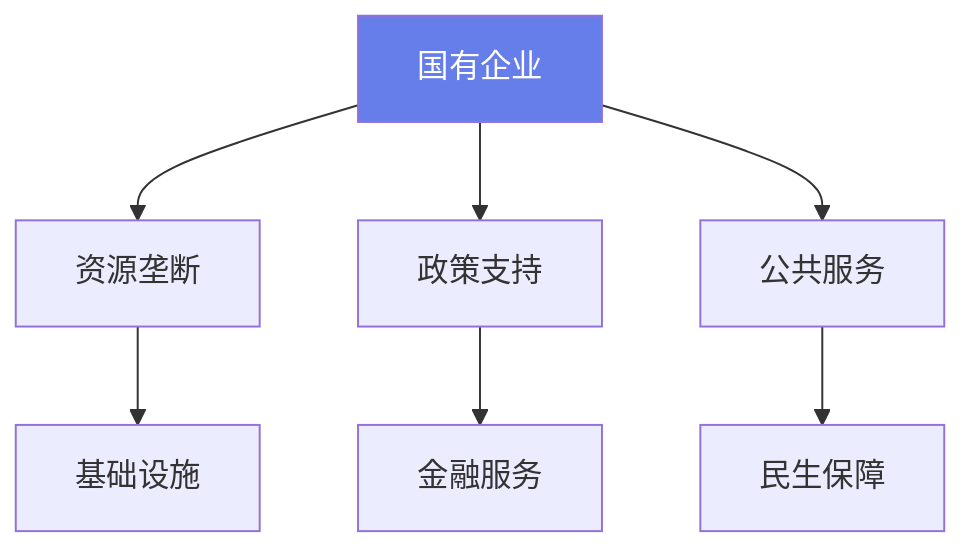

### 与民企对比

| 维度 | 国有企业 | 民营企业 |
|------|----------|----------|
| **核心资源** | 政策 + 垄断 | 市场 + 创新 |
| **盈利目的** | 社会效益优先 | 利润最大化 |
| **竞争优势** | 资源壁垒 | 效率 + 创新 |
| **风险特征** | 政策风险 | 市场风险 |

---

## 结语：商业模式的选择与演进

### 关键洞察

1. **单一模式的公司越来越少**，多元化收入结构成为主流
2. **线上线下融合（O2O）** 越来越普遍
3. **AI 驱动的个性化服务** 正在重塑各行业
4. **网络效应** 是大多数成功商业模式的核心

### 给创业者的建议

- **理解你的用户**：他们愿意为什么付费？
- **选择合适的模式**：没有最好的模式，只有最适合的模式
- **持续迭代优化**：商业模式需要随市场变化而调整
- **构建护城河**：网络效应、品牌、技术、数据都是可能的护城河

### 给投资者的建议

- **关注收入质量**：经常性收入优于一次性收入
- **评估网络效应**：双边网络效应是最强的护城河之一
- **审视单位经济**：LTV/CAC 比率是健康度的关键指标
- **警惕监管风险**：尤其是平台型和金融类业务

---

**商业模式是企业的 DNA**，它决定了企业如何创造价值、传递价值和获取价值。在这个快速变化的时代，理解并掌握这些商业模式，无论是创业、投资还是职业发展，都将为你带来巨大的竞争优势。

希望这篇文章能帮助你建立起对互联网商业模式的系统性认知。如果你觉得有价值，欢迎分享给更多需要的人！

---

*本文基于对互联网行业主流商业模式的系统梳理，旨在提供全面的知识框架。具体企业的商业模式可能更加复杂，需要结合实际情况深入分析。*
